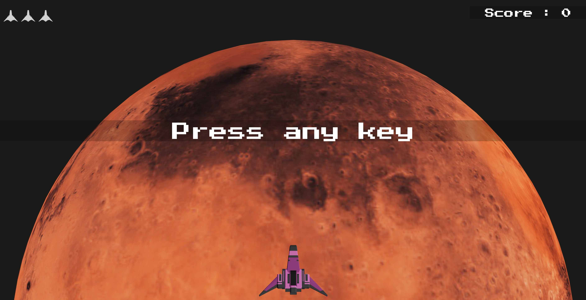

# Spacewar

Spacewar is an exciting shoot 'em up game created for the Three.js Journey Challenge 008. Take control of a small spaceship, navigate through a sea of enemies, and aim to survive as long as possible to achieve your highest score.

## Gameplay
- **Lives:** You start with 3 lives. Each time you are hit by an enemy, you lose a life. If you run out of lives, the game is over.
- **Scoring:** Score points by hitting enemies; each kill adds 100 points to your score.
- **Survival**: Be cautious, as enemies can get past your spaceship. However, each enemy passing by will return, adding one more enemy to the next wave.
- **Power-ups:** Upon defeating an enemy, there is a small chance they will drop a power-up. Grab these power-ups to increase your shot speed and enhance your chances of survival.
- **Enemy Waves**: As time passes, enemy waves become more challenging. Be prepared for increased enemy firepower.

## Challenge
Think you've got what it takes? Can you make it past the impressive 20,000 points milestone? Test your skills and see how far you can go!

## Demo:
Check out the live versions [here](https://www.mistermeo.com/spacewar)!

Feel free to explore the code and provide feedback. If you have any questions or would like to reach out, don't hesitate to contact [me](mailto:gregory.colmont@gmail.com).

Hope you enjoy this mini-game!

## Assets used by category
| Sounds | Usage | Authors | Licence |
|----------|----------|----------|----------|
| [Fire.mp3](https://opengameart.org/content/retro-shooter-sound-effects) | Shooting Sound| Muncheybobo | CC0 |
| [GameOver.mp3](https://opengameart.org/content/retro-shooter-sound-effects) | GameOver Sound | Muncheybobo | CC0 |
| [Hit.mp3](https://opengameart.org/content/retro-shooter-sound-effects) | Player Hit Sound | Muncheybobo | CC0 |
| [OldSchoolMain.mp3](https://opengameart.org/content/oldschool-action-theme) | Level Soundtrack | Joth | CC0 |
| [SFX_Powerup_01.wav](https://opengameart.org/content/8-bit-powerup-1) | PowerUp Sound | jalastram | CC-BY 3.0 |
# 3D Assets
| 3D Assets | Usage | Authors | Licence |
|----------|----------|----------|----------|
| [SpaceshipQuaternius.glb](https://quaternius.com/index.html) | Player Space Ship | Quaternius | CC0 |
| [SpaceshipTarget.glb](https://quaternius.com/index.html) | Enemy Space Ship | Quaternius | CC0 |
 # Fonts
  [Press Start 2P](https://fonts.google.com/specimen/Press+Start+2P?query=press) | Interface | CodeMan38 | OFL |